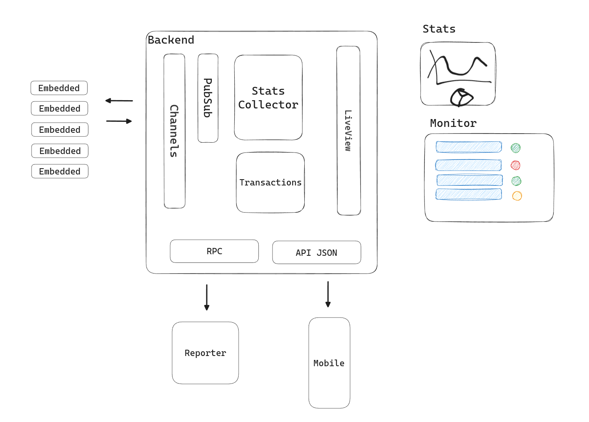

# Fullstack

This repo is for educational purposes about Erlang, Elixir, OTP and Nerves.

Will include contents like:
- Embedded applications
- Firmware 
- websockets
- PubSub
- Phoenix applications
- LiveView
- Concurrency
- Real-Time

* Official website: https://www.phoenixframework.org/
  * Guides: https://hexdocs.pm/phoenix/overview.html
  * Docs: https://hexdocs.pm/phoenix
  * Forum: https://elixirforum.com/c/phoenix-forum
  * Source: https://github.com/phoenixframework/phoenix
