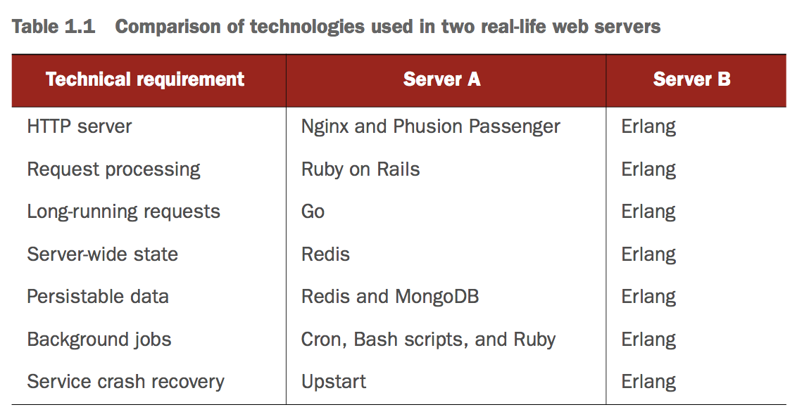
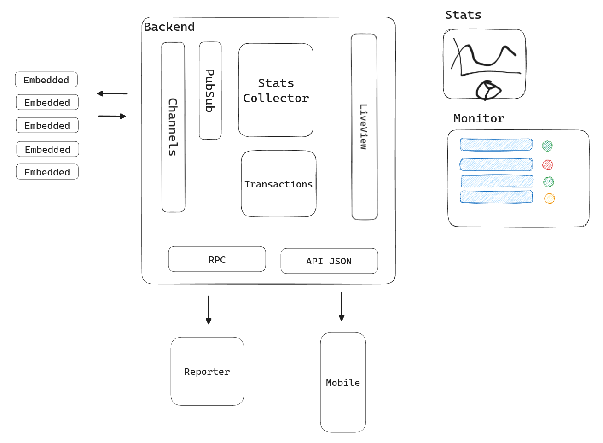

# FullStack
Erlang OTP / Elixir / Nerves

After been building infrastrcutre for millions of IoT devices connected to a Phoenix Backend, sending data and enable people to track everything real-time with Liveview and provide services to third-parties from APIs, I decided to share the knowledge with the community.

If you want to learn more about the journey and the product, you can watch the conference at ElixirConf US 2023 

I have seen lot of times this table from "Elixir in Action" book, and want to show how easy can actually is to enable this features in a real system. 

The abstract idea 

